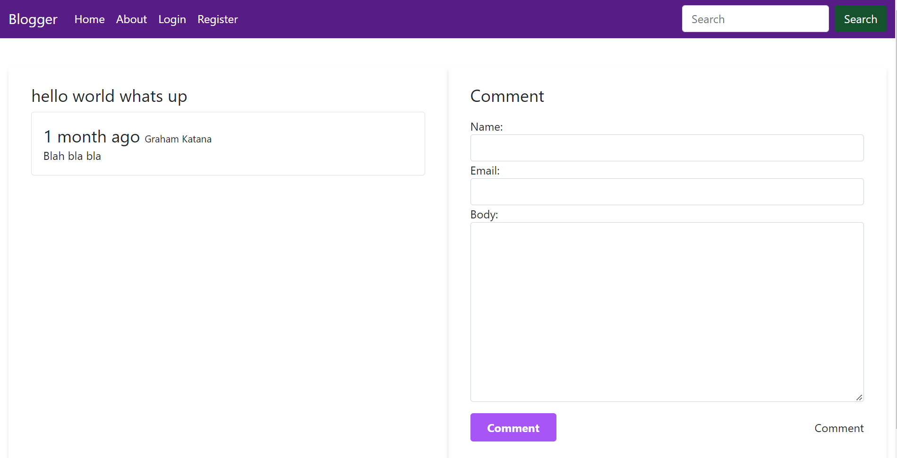

# simple blog using django
### cd into project folder and install dependencies
```Run server and visit http://localhost:8000```
The project includes custom forms that you can redesign as per your needs. Image uploads are also added.
###


